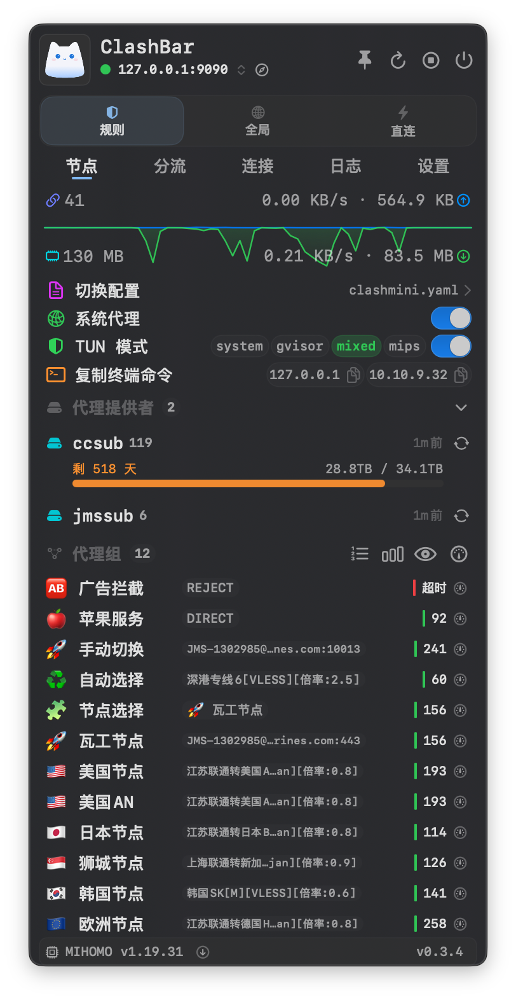
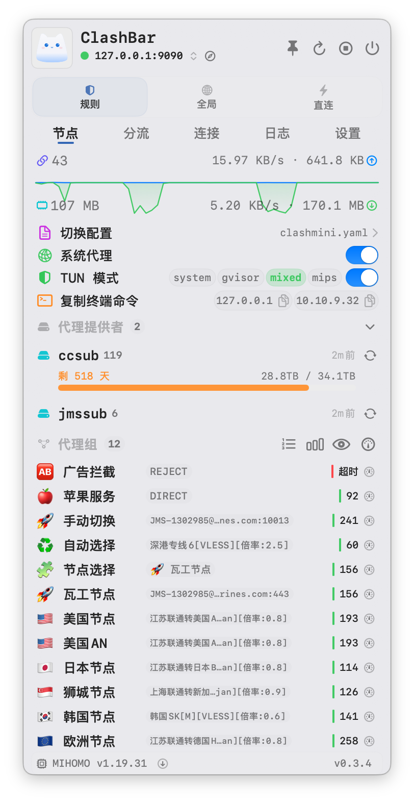

<div align="center">


# ClashBar

Нативный прокси-клиент для строки меню macOS на базе `SwiftUI + AppKit`, работающий на ядре `mihomo`.  
Легковесный и стабильный — управление профилями, узлами, правилами, соединениями и системным прокси прямо из строки меню. ✨

<p align="center">
  <a href="README.md">English</a> | <a href="README_zh.md">简体中文</a> | Русский
</p>

<p>
  
  
  
  
  <a href="https://github.com/Sitoi/ClashBar/releases" target="_blank" rel="noopener noreferrer">
    
  </a>
  <a href="https://github.com/Sitoi/ClashBar/stargazers" target="_blank" rel="noopener noreferrer">
    
  </a>
  <a href="https://github.com/Sitoi/ClashBar/issues" target="_blank" rel="noopener noreferrer">
    
  </a>
  <a href="https://github.com/Sitoi/ClashBar/pulls" target="_blank" rel="noopener noreferrer">
    
  </a>
  <a href="https://github.com/Sitoi/ClashBar/network/members" target="_blank" rel="noopener noreferrer">
    
  </a>
  <a href="https://github.com/Sitoi/ClashBar/releases" target="_blank" rel="noopener noreferrer">
    
  </a>
  <a href="https://github.com/Sitoi/ClashBar/commits" target="_blank" rel="noopener noreferrer">
    
  </a>
  <a href="https://github.com/Sitoi/ClashBar/commits" target="_blank" rel="noopener noreferrer">
    
  </a>
  <a href="https://github.com/Sitoi/ClashBar/blob/main/LICENSE" target="_blank" rel="noopener noreferrer">
    
  </a>
</p>

<p>
  🌐 <a href="https://clashbar.sitoi.workers.dev"><strong>Документация</strong></a>
  ·
  📦 <a href="https://github.com/Sitoi/ClashBar/releases"><strong>Релизы</strong></a>
  ·
  💬 <a href="https://t.me/clashbars"><strong>Telegram</strong></a>
</p>

</div>

<p>
  
  
</p>

## ✨ Особенности

- 🪶 **Легковесный**: Менее 15 МБ с встроенным ядром; менее 3 МБ без ядра
- 🧭 **Ориентация на строку меню**: Импорт и обновление профилей, переключение узлов, тест задержки, правила и диагностика соединений
- 🔐 **Интеграция с системой**: Системный прокси, автозапуск при входе в систему, Keychain для чувствительных данных
- 📊 **Мониторинг**: Трафик в реальном времени, активные соединения, использование памяти и фильтрация логов
- 🌍 **Многоязычность**: Английский / Упрощенный китайский (`zh-Hans`)

### 📏 Сравнение размера приложения (по данным Finder macOS, только для справки)

| Клиент | Размер |
| ---------------------- | -------: |
| ClashBar.app (Без ядра) | 3 МБ |
| ClashBar.app | 14.2 МБ |
| ClashMac.app | 75.2 МБ |
| Clash Verge.app | 128.4 МБ |
| Clash Party.app | 496.7 МБ |

## 📦 Установка

**Требования:** macOS 13+ 🍎

```sh
brew tap Sitoi/tap
brew install --cask clashbar
```

Или скачайте `.dmg` из раздела [Релизы](https://github.com/Sitoi/ClashBar/releases) и перетащите `ClashBar.app` в папку `/Программы` (`/Applications`).

Удаление:

```sh
brew uninstall --cask clashbar
# Полное удаление (включая конфигурации и данные)
brew uninstall --zap --cask clashbar
```

> [!IMPORTANT]
>
> - ⚠️ Убедитесь, что в один момент времени только один клиент на базе mihomo / Clash управляет системным прокси.
> - 📂 Работа системного прокси зависит от запакованного `.app` и разрешений автозапуска; перед использованием поместите приложение в `/Applications`.
> - 🔑 При первом включении системного прокси или автозапуска разрешите ClashBar в меню **Системные настройки → Основные → Объекты входа**.
> - 🔄 В случае сбоев переключения выключите и снова включите фоновое приложение ClashBar в объектах входа или нажмите `Restart` для перезапуска ядра в приложении.

## 🚀 Быстрый старт

1. 🖱️ Нажмите на иконку в строке меню, чтобы открыть панель
2. 📥 Выберите или импортируйте конфигурацию во вкладке Proxy
3. ▶️ Нажмите `Start` / `Restart` для запуска ядра
4. 🎛️ Выберите режим: `Rule` / `Global` / `Direct`
5. 📶 Выберите узел и проверьте задержку; убедитесь в доступности соединения перед включением системного прокси

Подробные руководства на сайте документации: 📖 [Быстрый старт](https://clashbar.sitoi.workers.dev/docs/quick-start) · [Функции](https://clashbar.sitoi.workers.dev/docs/features) · [Устранение неполадок](https://clashbar.sitoi.workers.dev/docs/troubleshooting)

## 🗺️ Обзор возможностей

| Вкладка | Описание |
| -------------- | ----------------------------------------------- |
| 🧭 Proxy | Конфигурации, режимы, системный прокси, переключение узлов, задержка и провайдеры |
| 📚 Rules | Статистика правил, фильтрация, обновление провайдеров |
| 🌐 Connections | Фильтрация и закрытие активных соединений |
| 🪵 Logs | Фильтрация по уровню логов, поиск по ключевым словам |
| ⚙️ System | Язык, строка состояния, порты, `allow-lan` / `ipv6` и др. |

📁 Директория данных: `~/Library/Application Support/clashbar`  
🧩 Встроенное ядро копируется в: `~/Library/Application Support/clashbar/core/mihomo`

## 🛠️ Разработка и сборка

```sh
# Требования: Xcode / Swift 6.2+, macOS 13+
make build                 # Сборка dist/ClashBar.app (по умолчанию без ядра)
make build WITH_CORE=1     # Сборка с встроенным ядром mihomo
make dist WITH_CORE=1      # Создание пакета app + dmg
```

## 🙌 Сообщество

- 🌐 Документация: <https://clashbar.sitoi.workers.dev>
- 💬 Telegram: <https://t.me/clashbars>
- 🐛 Issues / PRs: Будем рады вашим отзывам и пулл-реквистам!

## 👥 Участники разработки

[](https://github.com/Sitoi/ClashBar/graphs/contributors)

## 🙏 Благодарности

Спасибо проекту [MetaCubeX/mihomo](https://github.com/MetaCubeX/mihomo) за предоставление возможностей ядра.

## ⭐ Динамика звёзд (Star History)

[](https://www.star-history.com/#Sitoi/ClashBar&type=date&legend=top-left)
